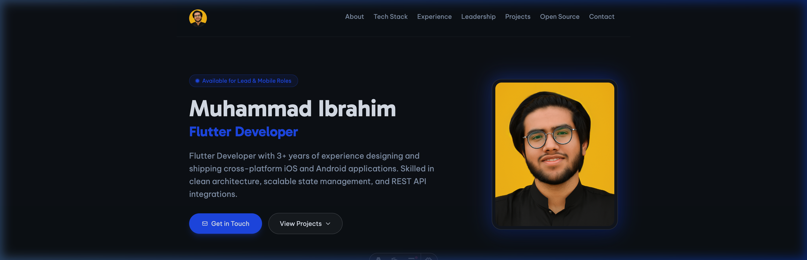

# 🚀 Muhammad Ibrahim — Personal Portfolio Website

[](https://astro.build/)
[](https://tailwindcss.com/)
[](LICENSE)

A modern, responsive, and high-performance personal portfolio website for **Muhammad Ibrahim** (Lead Flutter Developer & Mobile Engineer), built with **Astro**, **TypeScript**, and **Tailwind CSS**.



## ✨ Features

- ⚡ **Blazing Fast Performance**: Built with Astro's island architecture for zero JS by default and ultra-fast page load times.
- 🎨 **Modern & Sleek Dark UI**: Beautiful glowing gradients, interactive card hover effects, and custom scroll animations.
- 📱 **Mobile-First & Responsive**: Fully optimized across desktop, tablet, and mobile viewports.
- 🛠️ **Centralized Configuration**: Content and site settings easily managed via a single config file (`src/config/index.ts`).
- 🎯 **Rich Showcase**: Structured sections for About Me, Tech Stack, Work Experience, Leadership, Featured Projects, Open Source Contributions, and Contact.
- 🌐 **SEO & Accessibility Optimized**: Semantic HTML, meta tags, OpenGraph previews, and canonical URL support.

## 🛠️ Tech Stack

- **Framework**: [Astro](https://astro.build/)
- **Styling**: [Tailwind CSS](https://tailwindcss.com/)
- **Language**: [TypeScript](https://www.typescriptlang.org/)
- **Deployment**: Vercel

## 🚀 Getting Started

### Prerequisites

Ensure you have [Node.js](https://nodejs.org/) (v18+) and [pnpm](https://pnpm.io/) installed.

### Installation & Local Setup

1. **Clone the repository:**
   ```bash
   git clone https://github.com/mibra-heem/m-portfolio.git
   cd m-portfolio
   ```

2. **Install dependencies:**
   ```bash
   pnpm install
   ```

3. **Start the development server:**
   ```bash
   pnpm dev
   ```
   Open [http://localhost:4321](http://localhost:4321) in your browser to view the site.

4. **Build for production:**
   ```bash
   pnpm build
   ```

5. **Preview production build:**
   ```bash
   pnpm preview
   ```

## ⚙️ Customization

Edit `src/config/index.ts` to customize all portfolio details including bio, social links, experience, projects, skills, and contact info.

## 🤝 Attribution & Acknowledgments

This repository is maintained by **[Muhammad Ibrahim](https://github.com/mibra-heem)** (`mibra-heem/m-portfolio`).

It was originally adapted and customized from the open-source template **[AstroZen](https://github.com/immois/astro-zen)** created by **[immois](https://github.com/immois)**. Heartfelt thanks to the original author for providing the initial template foundation.

## 📄 License

This project is licensed under the MIT License - see the [LICENSE](LICENSE) file for details.
